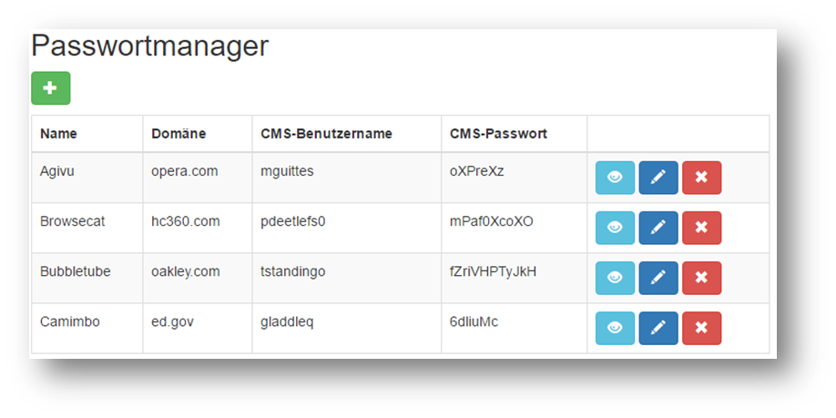
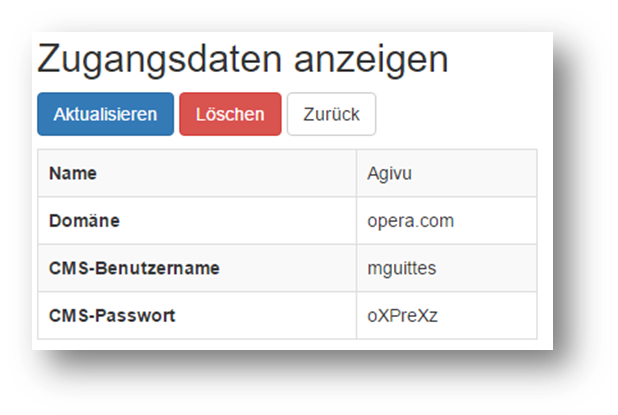

# Angabe - Passwortmanager

## Problemstellung
### Deine Rolle
Du bist Webentwickler bei der Firma WebDesign GmbH in Imst.

### Die Situation
Deine Firma betreut zahlreiche Content-Management-Systeme eurer Kunden. Um alle Webauftritte warten zu können, müssen deren CMS-Zugangsdaten von deinem Sekretariat verwaltet werden. Derzeit erfolgt dies mit Hilfe einer Excel-Liste. Um einen effizienteren Zugriff auf die Zugangsdaten zu ermöglichen, soll eine Webanwendung erstellt werden. Eine Kollegin aus der Grafikabteilung hat bereits ein HTML-Mockup als Entwurf gestellt.

### Dein Ziel
Dein Chef hat dich beauftragt einen funktionsfähigen Prototyp für die Verwaltung der Zugangsdaten zu erstellen. Zusätzlich zu den HTML-Mockups erhältst du für die Persistenzschicht ein Interface. Eine Benutzerauthentifizierung ist für den Prototyp nicht notwendig.

### Deine Zielgruppe
Die Applikation soll vom Sekretariat und von der Contentbetreuungsabteilung deiner Firma mit einem herkömmlichen Browser verwendet werden können. 

### Das erwartete Produkt

**Funktionen**

Der Prototyp sollte mindestens folgendes umfassen:
* Import der Daten aus der Excel-Tabelle in die Datenbank
* UML-Klassendiagram
* Eingabe und Validierung der Daten
* Dauerhafte Speicherung der Daten am Server (Datenbank)
  *	Create, Read, Update und Delete (CRUD) Operationen
* Vollständige Trennung von Darstellung und Geschäfts/Persistenzlogik
* Verwendung des Active Record Patterns
   *	Persistenz Logik innerhalb der Klasse
   *	Objektrelationales Mapping (ORM)
*	Integration der Anwendung in das vorgegebene Mockup (HTML/CSS Frameworks, z.B. Bootstrap)

### Mockups

